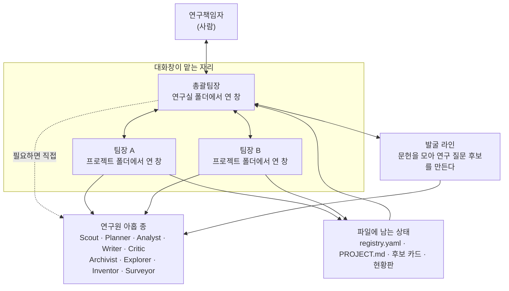

# AI 연구실 — 경량판 (핸즈온용)

혼자 여러 연구를 끌고 갈 때 막히는 것은 아이디어가 아니라 **어디까지 했는지를 잊는 것**입니다.
이 폴더는 Claude Code 위에서 도는 **연구실 한 채**입니다. 연구마다 팀이 하나씩 붙고, 문헌·설계·분석·집필·검토를 맡는
연구원 아홉 종이 필요할 때만 불려 나옵니다. 상태는 말이 아니라 **파일**에 남고, 현황판은 그 파일들에서 매번 다시 그려집니다.
이 판은 **핸즈온용**입니다 — 컴퓨터 한 대, Claude Code 하나로 **30분 안에 설치하고 한 바퀴** 돌려 보는 것이 목표입니다.

---

## 어떻게 생겼나



**총괄팀장과 팀장은 불러내는 것이 아니라 자리입니다.** 연구실 폴더에서 연 대화창이 총괄팀장이고,
프로젝트 폴더에서 연 대화창이 그 팀의 팀장입니다. 실제로 불려 나오는 것은 연구원 아홉 종뿐입니다.

---

## 핵심 원칙 다섯

1. **폴더가 곧 임명이다.** 어느 폴더에서 창을 열었는지가 그 창의 역할을 정합니다.
   프로젝트 폴더의 `CLAUDE.md` 안 '이 세션의 역할' 절이 그 창을 팀장으로 만듭니다.
2. **말로 전하면 사라진다.** 대화창끼리는 기억을 나누지 않습니다. 일을 마치면 `report.py status` 로 파일에 남기고,
   총괄은 지켜봐서가 아니라 **읽어서** 압니다.
3. **현황판은 손으로 그리지 않는다.** 등록부와 프로젝트 카드에서 매번 다시 만들어집니다 —
   화면을 고치는 것이 아니라 카드를 고칩니다.
4. **생성한 쪽이 검증하지 않는다.** 원고·분석·문헌 산출물은 Critic(적대적 검토)을 한 번 통과시킵니다.
   연구 대상 자체가 언어모델인 연구에서는 언어모델을 판정자로 쓰지 않습니다 — 순환논증이 됩니다.
5. **팀은 `팀이름_약어` 전체로 부른다.** `Terra` 가 아니라 `Terra_DEMO-SR` — 팀 이름만으로는 무슨 연구인지 알 수 없습니다.
   팀은 열 개로 고정이고, 프로젝트가 끝나면 그 팀이 다음 프로젝트를 받습니다.

---

## 설치 없이 앱에서 해 보기 (60분 핸즈온)

Claude 앱만 있으면 됩니다 — [프롬프트 카드 9장](docs/app-prompt-cards.md)을 순서대로 붙여 넣으면 총괄팀장 임명 → 연구 등록 → **연구원 셋을 내가 정의** → 팀장 창 → Scout·Critic → 현황판 → 발굴 판정까지 한 바퀴 돕니다. 종이 [워크시트](docs/worksheet.md)를 먼저 채우면 빠릅니다.

## 30분 시작하기

```bash
git clone https://github.com/JeonKH81/ai_research_team_light.git ~/ai_research_team_light   # 내려받습니다
cd ~/ai_research_team_light
python3 install.py                                 # 필요한 것을 확인하고 첫 현황판을 만듭니다 (윈도우: python install.py)
claude                                             # 이 창이 총괄팀장입니다
```

Claude Code 창이 열리면 첫 대화에서 **`/setup`** (다섯 문항, 10분) → 이어서 **`/hands-on`** 이라고 칩니다.
그다음부터는 총괄팀장이 여덟 단계를 하나씩 끌고 갑니다. 윈도우는 `python install.py` — 나머지는 같습니다([설치 문서](docs/install.md#윈도우에서는)).

본보기 연구 한 건(`projects/P01_demo-ecg-sr` — `Terra_DEMO-SR`, 지어낸 체계적 고찰)이 들어 있어
설치 직후에도 화면이 채워져 보입니다. 한 바퀴 둘러본 뒤 지우고 자기 연구를 넣으면 됩니다.

---

## 정식판과 무엇이 다른가

| 정식판에 있는 것 | 경량판 |
|---|---|
| 정해진 시각에 저절로 실행 (문헌 수집·아침 브리핑·랩미팅 준비) | 없음 — 필요할 때 손으로 돌립니다 |
| 컴퓨터 두 대 운용, 담당 컴퓨터 지정 | 없음 — 컴퓨터 한 대 |
| 다른 모델(Codex) 교차 검토 — 연구원 열 종 | 없음 — 연구원 아홉 종, 제2검토자 자리는 Critic 이 채웁니다 |
| 무인 실행과 그것을 막아주는 장치, 제안 큐 | 없음 — 모든 변경은 사람이 그 자리에서 합니다 |
| 팀별 작업시간 기록 | 없음 |
| 여러 화면으로 갈라지는 문 페이지, 현황판 인터넷 사본 | 없음 — 현황판 한 장을 내 컴퓨터에서 엽니다 |

정식판은 GitHub `JeonKH81/ai_research_team`(비공개·초대제)에 있습니다.

---

## 문서

| 문서 | 내용 |
|---|---|
| [docs/install.md](docs/install.md) | 사전 준비, 내려받기, 설치 확인 읽는 법, `/setup` 다섯 문항, 문제가 생기면 |
| [docs/handson.md](docs/handson.md) | 실습 대본 — 여덟 단계를 화면에서 보는 순서대로 |
| [docs/instructor-notes.md](docs/instructor-notes.md) | 진행자용 — 시간표, 막히기 쉬운 곳, 참석자에게 던질 질문 |

연구실 자체의 운영 규칙은 최상위 [`CLAUDE.md`](CLAUDE.md) 에 있습니다. 대화창은 이 파일을 먼저 읽습니다.

## 필요한 것

- **macOS · Windows · Linux** — 윈도우는 PowerShell([설치 문서](docs/install.md#윈도우에서는))
- **Git**, **Python 3.9 이상** (+ `pyyaml`·`truststore` — `install.py` 가 넣습니다)
- **Claude Code** + Claude 구독 로그인 (별도 열쇠 불필요)
- **인터넷** — Claude Code 대화와 문헌 수집에 필요합니다. 받아오는 곳(PubMed·medRxiv·arXiv·ClinicalTrials.gov)은 등록도 열쇠도 필요 없습니다

## 라이선스

MIT — [LICENSE](LICENSE)
